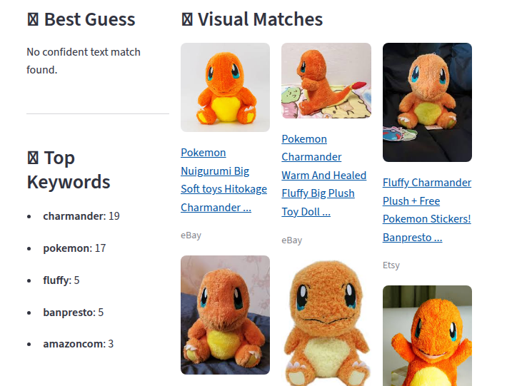
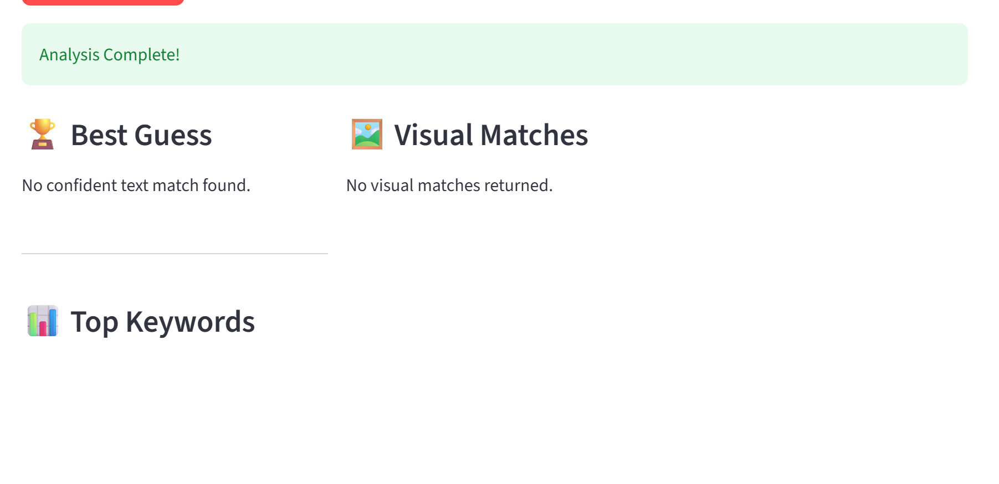

# Google Lens Visual Intelligence Service

Trying to do a reverse engineer of google lens so I can use it in another one of my project I am thinking off

# Project Description

This project was created as I wanted to try to make a "pokedex" and instead of fiddeling around with AI I wanted to use , the Google Lens engine as it is capable of identifying exact product names, brands, and fictional characters (e.g., "Pokémon Center Charmander Plush").


# Features
So I didn't want to fiddel around with web design, so I used Streamlit for the frontend.  It allow me to upload local files or capture images directly via webcam and I can test the various implementations I come accross 

Currently, there are 3 methods implemented to compare results:
1. Google Cloud Vision API (Official)
2. SerpApi (Google Lens Wrapper)
3. Custom Selenium Scraping (My own reverse-engineering attempt)

I use them to get the frequence of word that come out in the title to get the "best guess"


# The Architecture (The Process)

So it is a simple Client-Server where Streamlit is the front end and Flask is the back end calling the API/doing the scrapping

For scraping it uses ImgBB to upload a image temporarily to generate a publicly accessible URL for SerpApi and google lens to access

And for the scraping it Spins up a  Chrome instance. Navigates to lens.google.com the dynamic HTML using BeautifulSoup 

# Lessons Learned: API vs. Scraping
While playing arround, I tried the official Google Cloud Vision API vs the Lens "Scraper". The difference in data quality was significant.

1. The Limitation of Enterprise APIs
When passing a Charmander plush to the official Google Cloud Vision API, the model returned generic labels. It prioritized safety over specificity.


Result: "Stuffed Toy" (Technically true, but useless for a Pokedex).

But depending on the use case it can be more helpful like if I give it selfie SperAPI guess eye glasses while Google API guess human

2. The Power of Consumer API
By letting SerpApi to scrap Google Lens for us, we gained access to Google's data in simple clean json data to use it to impliment and I realised thats why alot of people use other people API


Result: Direct clear links to "Charmander Plush" listings.

3. Web scraping google lens by my self
So here is a successful picture of what it looked like to scrap I could improve it to give cleaner data but I only needed the title to try to test what the picture represents which is also what I did with SerpApi


Failed out put which is most of the time


You can see the Rrsult: "Charmander" appeared the most times. "Pokemon" appeared second most times. The identification make it pretty accurate compared to Google Cloud Vision API which only guess plush toy


# How to Run
## Prerequisites

- Python 3.9+
- Google Chrome installed on the host machine.
- An API Key from ImgBB.
- And API key for Serpapi or Google Cloud Vision API if you want to try the  2 methods

## 1. Setup Environment
Clone the repository and create a .env file in the root directory. If using Google Cloud,  download the json key and rename it as my-google-cloud-key.json: 

```Bash
IMGBB_KEY=your_api_key_here
SERPAPI_KEY=your_api_key_here
```
## 2. Install Dependencies

```Bash
pip install -r requirements.txt
```
## 3. Start the Backend (Flask)
This service listens for image requests on Port 5000.

```Bash
python server.py
# Output: Running on http://0.0.0.0:5000
```
## 4. Start the Frontend (Streamlit)
Open a new terminal to run the UI.

```Bash
streamlit run app.py
# Output: Local URL: http://localhost:8501
```

## 5. Run with Docker (Recommended for Stability)
I have dockerized the application to separate the frontend and backend dependencies. (should only be used for Google Cloud Vision API (Official) and SerpApi)

```Bash
docker compose up --build
```
**Note:** The "Selenium Scraping" method is highly unstable inside Docker due to Google's aggressive anti-bot detection (it detects the headless container environment). For the best results with the Selenium method, run it locally on your host machine. The API-based methods (Google Cloud, SerpApi) work perfectly in Docker.
# Future Improvements

- Better Anti-Bot measures: Google stops me from web scraping after a few attempts. I currently have to manually restart authentication or switch Wi-Fi to prove I am a human. I need to look into proxy rotation. (If you have any other suggesstion on how to web scrap better do let me know)

- Cloud Hosting: Find a way to host the scraper on the cloud instead of locally (Cloud IP addresses are blocked by Google almost instantly, which is a challenge I haven't solved yet). (So I can put it for people to try)

- try to get websraper to work for docker

- some logic error when you use both Take Photo and Upload Image tab at the same session without refresing it

